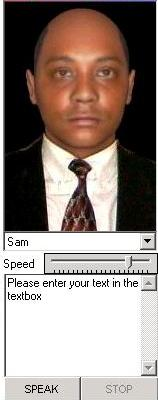



## SpeakingHead\.OCX

### Description

SpeakingHead.ocx is a control for text to speech with facial animation. At present, it only supports SAPI 4, but an upgrade is on its way (provided there is enough votes to inspire me :)
 
### More Info
 
Open the project, compile it, and copy the ocx to your system directory. Open a new project in vb then Goto project-&gt;components-&gt;browse (for the ocx),click apply. Add the ocx to your form. That's ALL. Alternatively, run the project as is.

             |
---                |---
**Submitted On**   |2005-12-07 22:12:04
**By**             |[Godfrey Philander](https://github.com/Planet-Source-Code/PSCIndex/blob/master/ByAuthor/godfrey-philander.md)
**Level**          |Advanced
**User Rating**    |4.8 (19 globes from 4 users)
**Compatibility**  |VB 4\.0 \(32\-bit\), VB 5\.0, VB 6\.0, VB Script
**Category**       |[Custom Controls/ Forms/  Menus](https://github.com/Planet-Source-Code/PSCIndex/blob/master/ByCategory/custom-controls-forms-menus__1-4.md)
**World**          |[Visual Basic](https://github.com/Planet-Source-Code/PSCIndex/blob/master/ByWorld/visual-basic.md)
**Archive File**   |[SpeakingHe1954741272005\.zip](https://github.com/Planet-Source-Code/godfrey-philander-speakinghead-ocx__1-63553/archive/master.zip)

